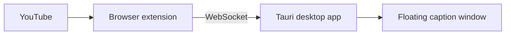

# Always On Subtitles

Floating, always-on-top YouTube captions that stay visible even when you're not in the browser tab.

## How it works

1. **Desktop app** (Tauri) — draws a transparent, always-on-top caption window and runs a local WebSocket server on `127.0.0.1:8756`.
2. **Browser extension** — reads YouTube caption cues and sends them to the desktop app.



## Requirements

- **Node.js** 20+
- **Rust** (for building the desktop app) — [install Rust](https://www.rust-lang.org/tools/install)
- **Chrome**, **Edge**, or **Firefox** (for the extension)

### Platform-specific (Tauri)

- **macOS**: Xcode Command Line Tools
- **Windows**: Microsoft C++ Build Tools, WebView2
- **Linux**: `webkit2gtk` and related packages — see [Tauri prerequisites](https://v2.tauri.app/start/prerequisites/)

## Quick start (development)

```bash
# Install dependencies
npm install

# Terminal 1 — desktop app
cd apps/desktop && npm run tauri:dev

# Terminal 2 — build extension
npm run build:extension
```

### Load the extension (unpacked)

1. Build the extension: `npm run build:extension`
2. Open `chrome://extensions` (or your browser's equivalent).
3. Enable **Developer mode**.
4. Click **Load unpacked** and select `apps/extension/dist`.

You can also use the desktop app's **Open extension folder** and **Open Chrome extensions** buttons in Settings.

### Use it

1. Make sure the desktop app is running (check the system tray).
2. Open any YouTube video with captions enabled.
3. The floating caption window appears automatically.

## Install (end users)

### Step 1: Desktop app

Download the installer for your OS from the [Releases](https://github.com/always-on-subtitles/always-on-subtitles/releases) page:

| Platform | Installer |
|----------|-----------|
| macOS | `.dmg` |
| Windows | `.msi` or `setup.exe` |
| Linux | `.AppImage` |

Run the installer. The app starts in the system tray and opens the settings window on first launch.

### Step 2: Browser extension

During development, load the unpacked extension from `apps/extension/dist` (see [Quick start](#quick-start-development)). The desktop app's Settings window can open the extension folder and Chrome's extensions page for you.

When published, this will be available from the Chrome Web Store.

### Step 3: Watch YouTube

Open any YouTube video. Captions appear in the floating window automatically.

## Settings

Open the desktop app from the system tray to configure:

- Font size and color
- Background opacity
- Dim or hide captions when paused
- Global enable/disable

Use the extension popup to toggle caption forwarding or reconnect to the desktop app.

## Build for production

```bash
# Build everything
npm run build

# Package desktop installers
npm run package:desktop --workspace=apps/desktop

# Package extension zip
npm run package:extension
```

Desktop bundles are written to `apps/desktop/src-tauri/target/release/bundle/`.
The extension zip is written to `apps/extension/release/always-on-subtitles-extension.zip`.

## Project structure

```
apps/
  desktop/     Tauri + Svelte floating window and settings UI
  extension/   Manifest V3 browser extension for YouTube
```

## Future: any video, no captions

The desktop app's subtitle pipeline is source-agnostic. A future **capture mode** can add screen/audio capture and local transcription, feeding the same floating window without changing the UI.

## Troubleshooting

### `cargo metadata` / `No such file or directory (os error 2)`

Tauri needs **Rust** (`cargo`). If you installed Rust but still see this error, your terminal may not have `~/.cargo/bin` on `PATH`.

**Quick fix (current terminal only):**

```bash
source "$HOME/.cargo/env"
cd apps/desktop && npm run tauri:dev
```

**Permanent fix:** add this to `~/.zshrc` (then open a new terminal):

```bash
source "$HOME/.cargo/env"
```

If Rust is not installed at all:

```bash
curl --proto '=https' --tlsv1.2 -sSf https://sh.rustup.rs | sh
source "$HOME/.cargo/env"
```

The project's `npm run tauri:dev` script also tries to load `~/.cargo/env` automatically.

## License

MIT
